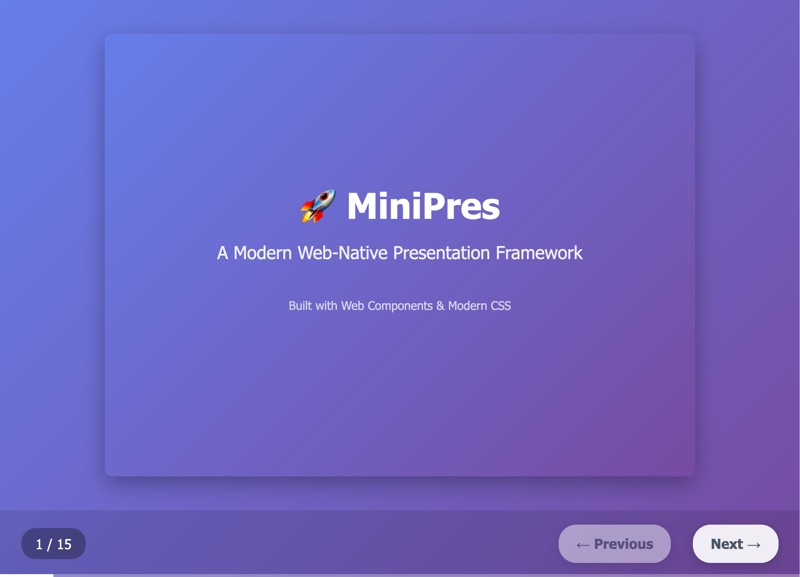

# MiniPres - Modern Web Presentation Framework

A lightweight, web-native presentation framework built with modern web technologies. Create beautiful, interactive slide presentations that run entirely in the browser without external dependencies.

## ✨ Features

- **🧩 Web Components**: Built with custom elements for clean, semantic HTML
- **📱 Responsive Design**: Automatic scaling with fixed 4:3 aspect ratio (1600×1200px slides)
- **🎨 Flexible Theming**: Comprehensive CSS custom properties for styling
- **⚡ Progressive Animations**: Element-level transitions with multiple animation types
- **🖼️ Smart Image Loading**: Lazy loading with adjacent slide preloading
- **⌨️ Full Keyboard Navigation**: Space, arrows, and zen mode shortcuts
- **🎯 Self-contained**: Complete presentations in single HTML files
- **♿ Accessibility**: Screen reader support and ARIA attributes
- **🧘 Zen Mode**: Distraction-free presentation mode

## 🚀 Quick Start

1. Leave Github and go to the [Codeberg Repo](https://codeberg.org/onemenzel/minipres) where this
   project lives now b/c I despise M$.
